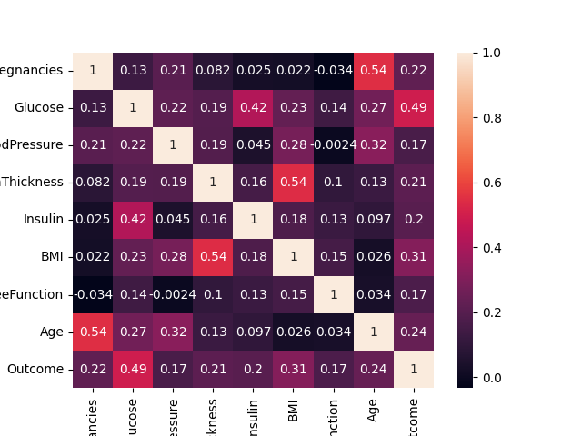

# 🩺 Diabetes Prediction using XGBoost

This project builds a machine learning model to predict whether a person has diabetes or not based on medical diagnostic features from the **PIMA Indians Diabetes Dataset**.  
We use **XGBoost** as the main classifier, along with **GridSearchCV** for hyperparameter tuning, and evaluate using recall, F1-score, and ROC-AUC (since the dataset is imbalanced).

---

## 📊 Dataset
- Source: PIMA Indians Diabetes dataset (`diabetes.csv`)  
- Rows: 768  
- Features: 8 medical predictor variables + 1 target variable (`Outcome`)  
- Target:
  - `0` → Non-diabetic  
  - `1` → Diabetic  

---

## ⚙️ Preprocessing
1. Replaced unrealistic `0` values with `NaN` in:
   - Glucose  
   - BloodPressure  
   - SkinThickness  
   - Insulin  
   - BMI  
2. Filled missing values with **median imputation**.  
3. Split dataset into train/test using `train_test_split`.  

---

## 🤖 Model Training
- **XGBoost Classifier** trained with imbalance handling:
  - `scale_pos_weight` to adjust for class imbalance (~65% vs 35%).  
- **GridSearchCV** used for hyperparameter tuning with scoring metric = `recall` to maximize correct detection of diabetics.  

---

## 📈 Evaluation
Metrics used:
- Accuracy  
- Precision  
- Recall (focus metric)  
- F1-score  
- ROC-AUC  

Plots generated:
- ROC Curves  
- Confusion Matrix Heatmaps  

---

## 📷 Results (Plots)

### Confusion Matrix (Baseline Model)

---

## ✅ Conclusion
- The baseline **XGBoost model** provides good predictive performance, but accuracy alone is misleading due to dataset imbalance.  
- By handling imbalance using **`scale_pos_weight`** and optimizing for **recall** via **GridSearchCV**, the model achieves better detection of diabetic patients.  
- ROC curves and confusion matrices confirm that the tuned model improves recall (catching more true diabetics) even if accuracy slightly decreases.  
- In medical prediction tasks, this trade-off is acceptable, since **minimizing false negatives (missed diabetics)** is more important than maximizing overall accuracy.  

---
